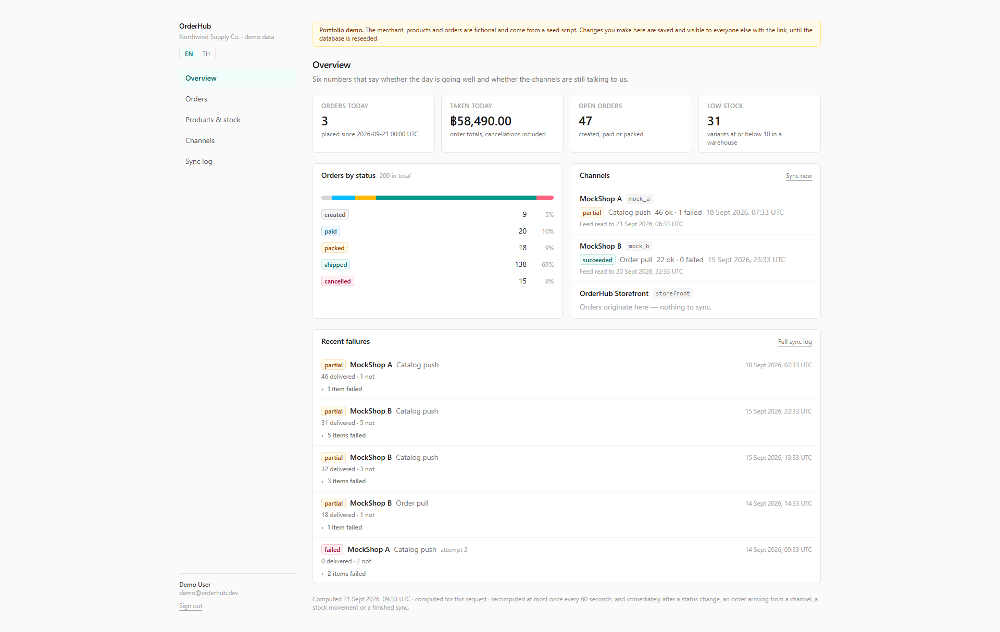
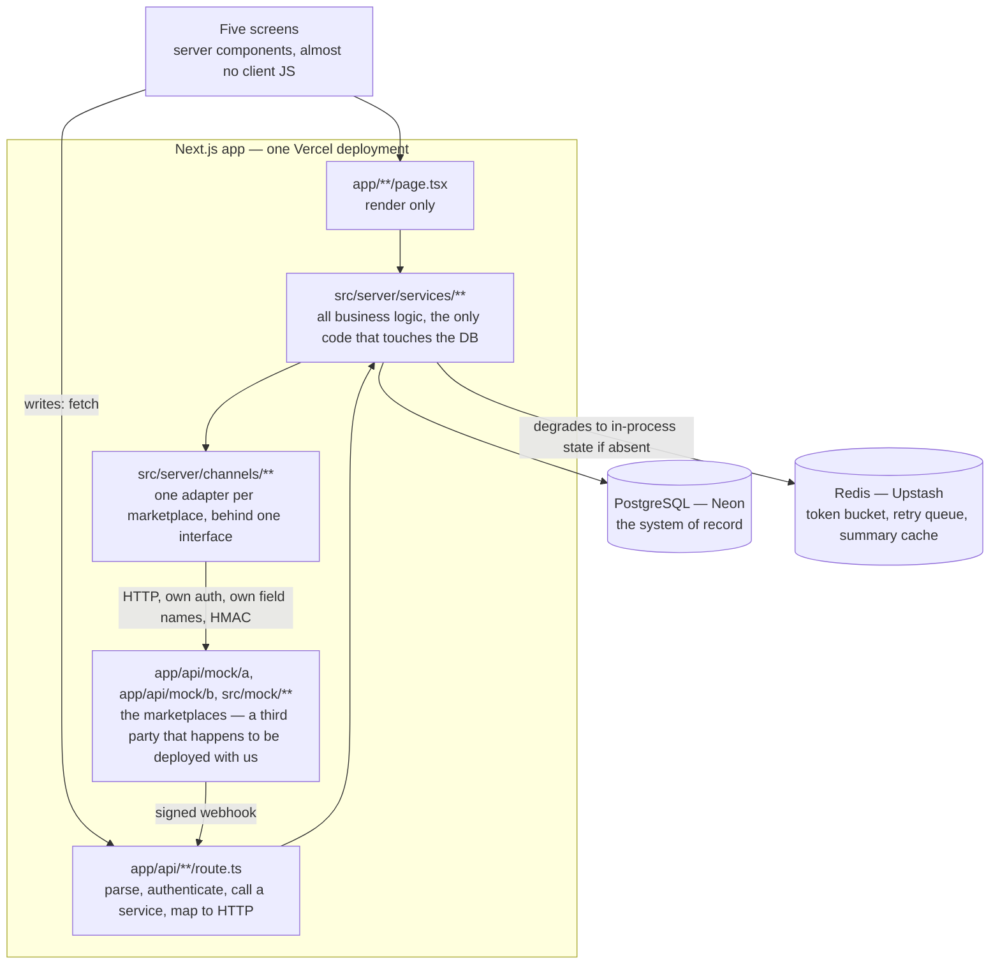
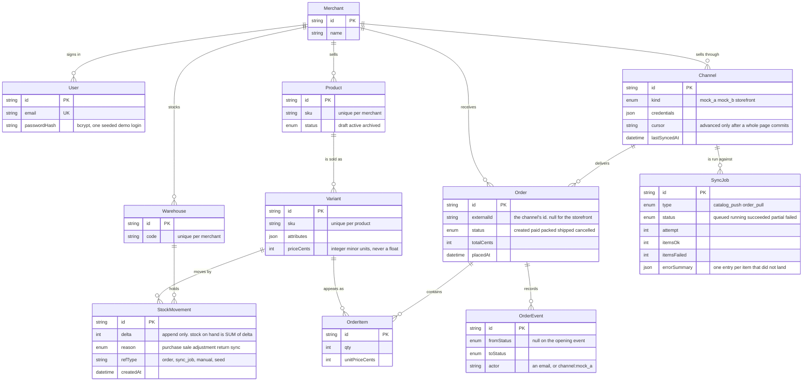

# OrderHub

A miniature omnichannel order hub: a product/stock/order core, two mock marketplace
connectors, and an admin dashboard — built to demonstrate the integration patterns
behind real multi-channel commerce. Orders arrive from two marketplaces that
disagree about everything two marketplaces can disagree about, stock on hand is
derived from a ledger rather than stored in a column, and every run against a
channel leaves a log you can read.

Next.js 16 (App Router) · TypeScript · Prisma 7 + PostgreSQL · Redis · Tailwind 4 ·
Vitest · pnpm. The data is fictional and comes from a deterministic seed.

**[Live demo](https://orderhub-delta.vercel.app/)** — `demo@orderhub.dev` /
`demo1234`. The dashboard is open and writable: a stock adjustment or an order
transition there is a real row that everyone else with the link will see, until
the database is reseeded.

## Why I built this

Eight years of my working life have gone into order-management systems — the
parts that reconcile stock, pull orders off marketplaces that each have their own
idea of what an order is, and then have to explain to somebody why a number is
wrong.
All of that is client code and none of it can be shown, so OrderHub is the same
set of problems rebuilt from scratch in public: small enough to read in an
evening, and specific about the handful of decisions that actually decide
whether an integration is correct.

## What's in it

<!-- Screenshots go here, one per screen, once the demo is deployed:
      and so on. -->

**Overview** (`/overview`) — today's orders and takings, orders by status, how
many variants are low, the last run per channel, and the runs that did not go
cleanly. One cached document rather than five endpoints, because it is one screen
and five round trips is five chances to show numbers that disagree with each
other.

**Orders** (`/orders`) — status, channel, date-range and search filters, all of
them in the URL so a filtered view survives a reload and can be pasted to
somebody else. Order detail has the items, the totals, the status timeline and
the transition buttons, greyed out by the same state machine that answers the
API.

**Products & stock** (`/products`) — the catalog, stock per warehouse, the
movement ledger underneath it, and an adjustment dialog that writes a movement
with a reason instead of editing a number.

**Channels** (`/channels`) — the two connectors, a catalog push and an order pull
each, what is waiting in the retry queue, and what is left of each channel's
request budget.

**Sync log** (`/sync-log`) — every run, `partial` included, with the per-item
failures expandable in place.

**Language and money.** Every screen reads in English or Thai, switched from the
sidebar and remembered in a cookie, and the demo merchant sells in baht — the
prices are minted as baht in the seed rather than converted from a dollar figure,
so they read like a Thai price tag rather than like an exchange rate.

**Sign-in** (`/login`) — one seeded account, bcrypt, and a signed cookie that
carries an id and an expiry and nothing else. The form arrives with the demo
credentials already in it, because the password is printed in this README and
making a reviewer type it buys nobody anything. What is behind it is real: five
attempts a minute through the same token bucket that paces the marketplaces, a
user row read on every request rather than trusted from the cookie, and one
function — `requireSignedIn()` for a page, `requireMerchantId()` for a route —
that every screen and endpoint already went through before any of this existed.

```
GET  /api/products?query=&status=&page=     POST /api/products
GET  /api/products/:id
GET  /api/stock?warehouseId=                POST /api/stock/movements

GET  /api/orders?status=&channelId=&from=&to=&query=&page=
GET  /api/orders/:id
POST /api/orders/:id/transition             -> { to: "packed" }, 409 on an illegal move

GET  /api/channels
POST /api/channels/:id/sync/catalog         -> runs the push, answers with the job
POST /api/channels/:id/sync/orders          -> reads the feed, answers with the job
POST /api/channels/:id/sync/retries         -> pushes only what the queue says is due
GET  /api/sync-jobs?channelId=&status=&type=&page=
GET  /api/dashboard/summary                 -> cached 60s, x-cache: HIT|MISS
POST /api/auth/login                        -> 401 on a wrong password, 429 after five
POST /api/auth/logout
POST /api/webhooks/:kind?token=             -> verify token, then signature, then apply

POST /api/mock/a/catalog/batch              -> MockShop A: <=50 items, per-item results
GET  /api/mock/a/orders?cursor=&limit=      -> MockShop A: cursor-paginated feed
POST /api/mock/a/webhooks/send              -> MockShop A: an HMAC-signed delivery

POST /api/mock/b/listing/upsert             -> MockShop B: <=10 listings, answered in groups
GET  /api/mock/b/order/list?page_token=     -> MockShop B: a feed read by watermark
POST /api/mock/b/hooks/dispatch             -> MockShop B: base64 signature, ms timestamp
```

## Architecture



Three rules hold that shape up, and each of them is one of the answers this
project exists to give out loud.

**`app/` never imports Prisma.** Route handlers and pages parse input, call a
service and turn the result into a response; everything that knows what an order
*is* lives in `src/server/`. That is what keeps the honest answer to "why not
NestJS?" true — the service layer would lift out of this repo unchanged, and
what would have to be rewritten is the thin part.

**Errors are codes until the last moment.** Services throw an `AppError` with a
code; one module maps code to status. A service never builds a `NextResponse`,
so the same service can be called by a page, a route handler and a test without
any of them learning HTTP.

**An adapter and its mock share no contract.** MockShop A and B are routes in
this same deployment and could have been imported as functions. Reaching them
over `fetch` with an API key, a timeout and a schema to validate the answer is
what makes the mapping and the failure handling real code. `src/server/channels/`
may not import a type, a schema or a constant from `src/mock/` — each side
restates the wire format, exactly as it would if the marketplace were a company
with a PDF. Sharing a payload's shape is what turns an integration test into a
tautology.

Conventions that follow from the same instinct: money is integer minor units all
the way to the edge and is formatted only when rendered; dates are UTC ISO
strings in every payload; validation is zod schemas in `src/lib/schemas/`, parsed
by the route handler and reused by the client form, so the browser and the server
enforce one set of rules rather than two that drift.

**The screen speaks two languages; the API speaks one.** Every word of the UI
comes out of a typed dictionary in `src/lib/i18n/` — English is the type, so a
key missing from the Thai copy is a build error rather than an English word in a
Thai sentence — and the choice is a cookie the server reads, not a segment in
the URL. What is deliberately not translated is anything a program reads: an
`AppError` message, a 409 refusal from the state machine, a rejection quoted
back from a marketplace. Those are the API's own words, and an API that
answered in whichever language the last browser asked for would be a worse API.

## Data model



Nine tables, and three of the decisions behind them are the ones worth arguing
about.

### 1. Stock is a ledger, not a number

There is no `qty` column anywhere in this schema, and there must never be one.
Stock on hand is `SUM(delta)` grouped by `(variantId, warehouseId)` over an
append-only `StockMovement` table; a correction is a new row with a negative
delta and a reason, never an edit and never a delete.

The reasons are the ones that matter at two in the morning. A mutable quantity
answers "how much is there" and nothing else, so when the number is wrong — and
in this domain the number is eventually wrong — there is nothing to read.
A ledger answers "why is it that much", and the answer is a list of rows with
timestamps and causes. Concurrency gets easier rather than harder: two sales
against the same variant are two inserts that cannot lose an update between
them, where two read-modify-writes of a counter can.

The derivation lives in one pure module, `src/server/stock/levels.ts`. Product
detail hands it raw movement rows; list views hand it rows Postgres has already
summed with `GROUP BY`. Summing a set that is already one row per pair returns
that row, so the SQL aggregation is an optimisation and not a second
implementation of the arithmetic — and the equivalence is asserted in the tests.

The cost is real and is the first question an interviewer should ask: reads pay
for an aggregate. At this size that is a `GROUP BY` over a few thousand rows and
it does not matter. The answer at a size where it does is a `StockLevel` table
written in the same transaction as the movement with `SET qty = qty + $delta` —
a materialised derivation the database keeps honest, not a number some
application code decided to cache.

The one place the ledger needs help is the check that a manual adjustment will
not drive a pair below zero. There is no quantity row to lock, so the check and
the insert share a transaction-scoped Postgres advisory lock keyed on the pair.
Five concurrent removals of 50 against a level of 157 commit three and reject
two.

### 2. `unique(channelId, externalId)` — the bug that bites every integration

Pulling orders from a marketplace is at-least-once delivery: pages get re-read,
webhooks get redelivered, a run dies halfway and starts again. Say plainly what
goes wrong when that is not handled, because it is the single most common defect
in this whole category of software — the same order lands twice, stock leaves
twice, and somebody ships two parcels.

The guard is a database constraint, not application code. The sync writes orders
with an `upsert` on `(channelId, externalId)` and treats a `P2002` as "already
have it". It never does `findFirst` and then `create`: two concurrent pulls both
see nothing, both insert, and the second one is a duplicate that no amount of
careful reading would have prevented.

`Channel.cursor` is the other half. It advances only after a whole page has
committed, so a crash mid-page replays that page rather than stepping over the
orders it never wrote — which is safe precisely because the constraint above
makes the replay a no-op. Neither half works alone.

`externalId` is nullable, because storefront orders do not have one. Postgres
treats NULLs as distinct, so the unique index does not collide on them, and the
storefront can write as many orders as it likes. That is deliberate, not an
oversight in the index.

### 3. `partial` is a first-class outcome

A batch API fails per item, not per request. MockShop A answers `200` with a
result for each of the fifty listings it was sent; a run where 81 landed and 6
were rejected is `partial` — not `failed`, which would throw away the 81 and
invite a retry that pushes them all again, and not `succeeded`, which would hide
the 6.

So `SyncJob` counts `itemsOk` and `itemsFailed` and keeps an `errorSummary` of
`{ ref, code, message }`, and the status is decided by one pure function: all ok
is `succeeded`, none ok is `failed` (there is nothing partial about nothing
working), anything between is `partial`. A batch that fails as a whole — the
connection dropped, the key was rejected — records its items as failed and the
next batch is still attempted, so the counts stay counts of items.

The screens are built around the distinction rather than flattening it: `partial`
is amber and not red in the sync log, and the overview lists partial runs
alongside failed ones. A dashboard that only surfaced total failures would hide
every one of these — the six rejected listings would sit unread while the channel
card said the last push went fine.

## Integration patterns

**Idempotency.** Covered above as a schema decision, because that is what it is:
the guarantee belongs to the database. Everything the sync does is written so
that running it twice is not different from running it once.

**Batch partial failure.** The `partial` outcome, the per-item error list, and a
runner that keeps going after a batch fails. The rule is one pure function in
`src/server/sync/runner.ts`, so the four outcomes can be tested without a channel
or a database anywhere near them.

**Two marketplaces, one interface, nothing shared.** MockShop B disagrees with A
about everything an integration can disagree about: Basic auth instead of a key
header, `order_reference` instead of `id`, `17/09/2026 22:00:00` in Singapore
time instead of ISO UTC, `"349.70"` instead of `34970`, ten listings a call
instead of fifty, answers grouped into accepted and rejected instead of one
result per item, and a feed paginated by a watermark instead of an opaque id.
All of it stops in `src/server/channels/mock-b-mapping.ts`; the service above
calls the same four methods and cannot tell the two channels apart.

**Webhook verification, in three steps.** The verify token in the URL says this
is a URL we handed out; the HMAC over `timestamp.body` says the channel really
sent these bytes; only then is the payload parsed. The body is read as text and
never re-serialised — signing a re-encoded object passes locally, where both ends
are the same JSON encoder, and fails against every real marketplace. A delivery
that cannot be applied, such as a cancellation of an order already shipped, is
answered `200` with a reason: a 4xx would make the channel redeliver it every few
minutes for a day.

**Retry with backoff, for the failures worth repeating.** A listing MockShop B
rejected because it does not carry that category will be rejected identically in
fifteen seconds, in thirty, and in four minutes. So the retry queue takes
failures whose code is *ours* — unreachable, 5xx, out of budget, our own bug —
and leaves the channel's per-item verdicts in the job's error list where a human
can read them. Backoff is 15s doubling to 4m with ±20% jitter, five attempts,
then the item is abandoned and the log says so. The queue holds a SKU and an
attempt count, never the payload: when the retry runs the variant is read from
Postgres again, at its current title and price. A retry run is a `catalog_push`
with `attempt > 1` — no new job type, no new table.

At the transport level the same instinct applies in miniature: a 5xx is retried
twice with backoff on the calls the channel documents as safe to repeat, and a
429 is deliberately *not* retried. The channel has just said it is being asked
too often; asking again 200ms later is the one answer guaranteed to be wrong.

**Rate limiting, before the 429 rather than after it.** MockShop B allows ten
requests per fixed minute. A token bucket refills smoothly, so the only way one
stays inside a fixed window is `capacity + refillPerMinute <= limit` — B's
connector uses 6 + 4, and the test drives the real algorithm for two simulated
hours to prove that no sixty-second span ever holds eleven requests. The honest
consequence is that a full catalog push, about nine batches, does not fit in one
run's budget; loosening the numbers so it would means choosing to earn the 429s
the limiter exists to avoid. So the run ends `partial` and the items it never
sent go to the queue — which is why the limiter and the retry queue are one
design and not two. A token is spent before every attempt, retries included,
because a retry is a request the marketplace counts like any other. MockShop A
publishes no limit and gets a courtesy cap anyway: an undocumented limit is still
a limit, and hammering an endpoint is how integrations find out what it was.

**Redis is never the system of record.** Everything in it — the bucket, the
queue, the dashboard summary — is a schedule, a counter or a copy, and losing all
of it costs a re-push and a recomputed page. Every call is wrapped so that an
outage degrades a feature instead of failing a request; a limiter that cannot
reach Redis fails *open*, because the 429 path already exists and a Redis outage
stopping all syncing is the worse failure. With Upstash unconfigured, all three
features fall back to in-process state and say so once at startup, so a fresh
clone runs with nothing but a database.

**One cache, and four places that drop it.** The overview summary is the only
cached read in the app: six counts across four tables, on the screen a visitor
lands on and reloads, where sixty seconds of staleness buys something and costs
nothing anybody would notice. It is invalidated by a status change, an order
arriving from a channel, a stock movement and a finished sync — four call sites
a reader can check against the summary's own fields, rather than a Prisma
middleware that fires on every write and drops the cache for changes that alter
none of these numbers. Everything else reads through to Postgres on purpose: a
cache in front of the orders list would have to be invalidated by every write in
the system, and the invalidation would be the bug.

## What is tested, and what is not

Nine suites, no database and no network in any of them. Each one covers a rule
that would be expensive to get wrong, which is a different thing from covering
the code that happens to exist.

| Suite | What it pins down |
|---|---|
| `stock-levels` | negatives, multiple warehouses, movements that net to zero, pairs with no movements at all, and the equivalence between raw and pre-aggregated rows |
| `order-state-machine` | every legal transition, and all 25 status pairs asserted against a hand-written list, so no illegal move can be introduced by widening the table |
| `order-pull-idempotency` | the real ingest path against a fake table that enforces the real unique constraint: a page read twice writes 25 rows and then none; a page that only half wrote leaves the cursor alone and replays whole |
| `channel-mapping` | MockShop B's dates across the date boundary and in the day/month order it invites getting wrong, its decimal money without a float in sight, its grouped batch answer |
| `catalog-batch` | the per-item rules, an adapter reading a batch response over a stubbed transport, and all four outcomes of the status rule |
| `webhook-signature` | sign/verify round trip, wrong secret, a body changed by one character, a signature moved to a fresh timestamp |
| `token-bucket` | refill in proportion to elapsed time, capacity as a ceiling, a clock that runs backwards, the wait a refused caller is told to expect, and the sixty-second-window simulation |
| `retry-queue` | which codes are worth retrying, the doubling and its jitter bounds, attempts counted across runs until an item is abandoned |
| `session-cookie` | a payload edited after signing, a signature from another secret, a signature lifted from another cookie, expiry to the second, and that a missing or malformed cookie reads as signed out rather than throwing |

The services, the route handlers, the UI and the language layer are deliberately
untested. They are
wiring — parse, call, map, look a word up — and the parts they wire together are
the nine suites above. Writing shallow tests for them would raise a coverage number without
raising the chance that this software is correct, and pretending otherwise in a
portfolio project seems a strange thing to do.

```bash
pnpm test        # vitest run
pnpm typecheck   # tsc --noEmit
```

## How I worked

<!-- Noramon: this section is yours to write, in your own words. What you
     specced, what Claude Code generated, how you reviewed it, what you sent
     back. It is the one part of this README an interviewer can tell was not
     generated — so it should not be. -->

_To be written._

## Not in scope

Five things a reviewer will notice are missing. Each is missing on purpose, and
the reason is the same in every case: this project is about integration
correctness, and anything that would have been a well-trodden implementation of
something else was left out rather than half-built.

**Real payments.** An order becomes `paid` because somebody clicked "Mark paid".
A payment provider would add a webhook, a reconciliation job and a sandbox
account, and would demonstrate nothing this codebase does not already
demonstrate with the marketplace webhooks.

**Multi-tenancy beyond `merchantId`.** Every table carries a merchant and every
service takes one as its first argument, so the column that real isolation would
be built on is there. Row-level security, per-tenant connection routing and the
migration story that comes with them are a project of their own.

**Account management.** Signing in is built and is not a toy — bcrypt, a signed
httpOnly cookie, a throttle, the user row read on every request. What is absent
is everything around it: there is no sign-up, no password reset, no second
factor, no roles, and no way to end somebody else's session except by deleting
their user. The demo has one account, so none of that would have been exercised
by anything; each of them is a decision with real alternatives and would deserve
building properly rather than sketching.

**Localised routing, and more than two languages.** The language is a cookie the
server reads, not a `/th/…` segment, and there is no `Accept-Language` sniffing:
the switcher is on every screen and a header that quietly overrode it would make
the button look broken. That trade is deliberate — locale-prefixed routes buy
shareable per-language URLs and something for a crawler to index, and cost a
restructured `app/` and a middleware, which is a poor bargain for a demo with
one audience. Currency is a column and formatting already goes through one
module, so a second currency is a data question rather than a code one; nothing
here converts between them, because a rate that is not fetched is a lie.

**A separate API service.** The route handlers are thin and the services below
them have no Next.js in their imports, so the extraction is mechanical if the
day comes. Doing it now would buy a second deployment to configure and a network
hop between two halves of the same transaction.

## Run locally

Needs Node 22+, pnpm, and a PostgreSQL connection string (this project uses a
[Neon](https://neon.tech) free-tier database — there is no Docker setup).

```bash
pnpm install
cp .env.example .env          # then paste your DATABASE_URL
pnpm db:migrate               # create the schema
pnpm db:seed                  # 50 products, 200 orders, 60 days of history
pnpm dev
```

The seed is deterministic (`faker.seed`), so two people running it get the same
demo, and it always leaves the app non-empty: three warehouses, fifty products,
two hundred orders across sixty days and all five statuses, some low-stock
variants, and a sync log that already contains a `partial` run. Its sixty days
end on the day you run it, so the overview's "today" is the day of the seed —
reseed before taking screenshots.

Redis is optional locally. With `UPSTASH_REDIS_REST_URL` and
`UPSTASH_REDIS_REST_TOKEN` unset, the rate limiter, the retry queue and the
dashboard cache run on in-process state and log one warning — everything works,
in one process. Set them (an [Upstash](https://upstash.com) free database takes a
minute to create) to run the way the deployment does.

Demo login: `demo@orderhub.dev` / `demo1234` — seeded and bcrypt-hashed, printed
on the landing page and already filled into the sign-in form.

`SESSION_SECRET` signs the session cookie. Unset locally it falls back to a
constant so a fresh clone runs, the way the Redis features fall back to memory;
in production it is required and the app refuses to start without it, because a
well-known signing key is not a degraded feature.

## Deploy

Vercel for the app, [Neon](https://neon.tech) for Postgres and
[Upstash](https://upstash.com) for Redis, all three free tier. Neon runs two
branches — `dev` for the laptop and `production` (Neon's default branch) for the
deployed demo, region `ap-southeast-1`.

### 1. Neon

Copy the **pooled** connection string for the `production` branch — the host
contains `-pooler` — and make sure it ends with `?sslmode=verify-full`.

### 2. Vercel project

| Setting | Value |
|---|---|
| Framework preset | Next.js (detected) |
| Root directory | repository root |
| Install command | default `pnpm install` — its `postinstall` runs `prisma generate` |
| Build command | default `pnpm build` = `prisma generate && next build` |
| Node version | 22.x, from `engines.node` |
| Function region | `sin1`, set by `vercel.json` |

The region is not a detail. Neon lives in `ap-southeast-1`, and functions running
in Vercel's default Washington region would cross the Pacific for every query on
a page that makes several.

### 3. Environment variables

Add these to the project **before the first deploy**. The build imports
`src/server/db.ts`, which throws when `DATABASE_URL` is missing, so a project
without it fails at build rather than at runtime.

| Variable | Value |
|---|---|
| `DATABASE_URL` | the pooled `production` connection string |
| `DEMO_EMAIL`, `DEMO_PASSWORD` | the seeded login, printed on the landing page |
| `SESSION_SECRET` | any long random string — signs the session cookie, and the deployment will not serve a page without it |
| `UPSTASH_REDIS_REST_URL`, `UPSTASH_REDIS_REST_TOKEN` | the Upstash database's two values |

The connector reaches the mock marketplaces over HTTP, so it needs to know the
deployment's own origin. `APP_BASE_URL` sets it; left unset, it falls back to
Vercel's per-deployment `VERCEL_URL`, which is what you want on a preview so it
talks to itself rather than to production. The mock marketplaces' credentials —
`MOCK_A_API_KEY`, `MOCK_B_CLIENT_ID`, `MOCK_B_CLIENT_SECRET` and the two
`*_WEBHOOK_SECRET`s — default to the values the seed writes onto the channel
rows, so they only matter if you intend to change them, and then the seed has to
be run again. `WEBHOOK_VERIFY_TOKEN` is the token in the webhook URL each mock
was given; both ends fall back to the same demo value.

Two of these have no usable default, in two different ways. `SESSION_SECRET` is
the strict one: missing in production it throws, and every page 500s rather than
signing cookies with a key that is in a public repository. The Upstash pair is
the lenient one — unset, the deployment still runs, but its rate limiter and
retry queue live inside whichever instance happened to answer, which is the same
as not having them. The difference is the point: a missing cache degrades a
feature, and a missing signing key is a way in. One Upstash
database serves production and every preview — keys are prefixed with
`VERCEL_ENV`, so a preview branch cannot drain production's retry queue or hand
it a stale summary.

The landing page is statically rendered, so changing either `DEMO_*` value needs
a redeploy before the card on it catches up.

### 4. Migrate and seed the production branch, from your laptop

```bash
cp .env.example .env.prod    # set DATABASE_URL to the production branch
pnpm db:deploy:prod          # prisma migrate deploy
pnpm db:seed:prod            # 3 warehouses, 50 products, 200 orders
```

`.env.prod` is gitignored by the `.env*` rule. The name is deliberate: Next.js
loads `.env.production` by itself during `next build` and `next start`, so a file
by *that* name sitting in the working tree would quietly point a local build at
the live database. Nothing loads `.env.prod` except the two scripts above, which
name it explicitly through Node's `--env-file` — and that wins over `.env`,
because dotenv never overwrites a variable that is already set. Neither script
can quietly rewrite your dev branch, and the seed prints the host it is about to
rewrite before it deletes anything.

**`db:seed:prod` is destructive**: it deletes every row in every table and writes
the demo data again. That is the point — the seed is deterministic
(`faker.seed`), so running it returns the live demo to exactly the state the
screenshots were taken in, and an empty demo reads as a broken one. Run it once
after the first `db:deploy:prod`, and again whenever the demo has been clicked
about too much.

### 5. Every deploy after the first

Push to `main`. Vercel builds from the repo; only a schema change needs
`pnpm db:deploy:prod` run again from the laptop.

---

The spec this was built from is [OrderHub Build Brief.md](OrderHub%20Build%20Brief.md),
and the rules each session was held to are in [CLAUDE.md](CLAUDE.md).
